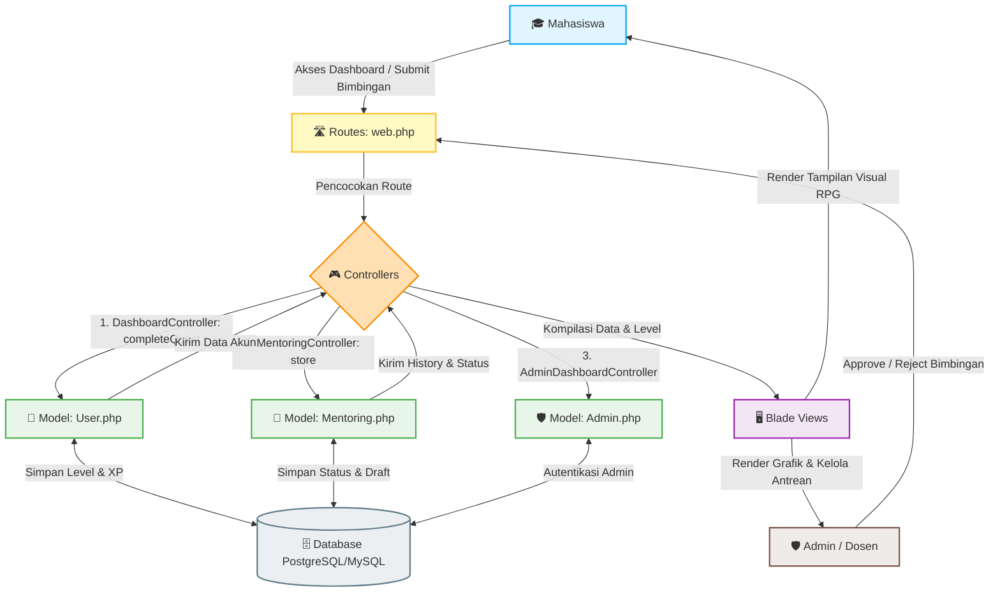

# 🏛️ Arsitektur MVC — BIMA Gamifikasi

Dokumen ini menjelaskan rancangan **Model-View-Controller (MVC)** yang diterapkan pada platform **BIMA** (Bimbingan Mahasiswa Informatika). BIMA mengubah pengalaman bimbingan skripsi yang biasanya menegangkan menjadi petualangan RPG (_Role-Playing Game_) fantasi yang interaktif dan memotivasi mahasiswa UPN Veteran Jatim untuk menuntaskan tugas akhir mereka.

---

## 🗺️ Visualisasi Aliran MVC BIMA

Berikut adalah diagram alir bagaimana interaksi pengguna (Mahasiswa/Admin) diproses melalui arsitektur MVC di platform BIMA:



---

## 🗂️ Analisis Komponen MVC

### 1. 📂 Model (M) — Manajemen Data & Logika Gamifikasi

Model di Laravel bertindak sebagai perantara tabel database (Eloquent ORM) sekaligus tempat terbaik untuk meletakkan logika bisnis inti agar Controller tetap bersih (_Thin Controller, Fat Model_).

#### 👤 [User.php](../app/Models/User.php) (Tabel `users`)

Model utama yang merepresentasikan **Mahasiswa** sebagai pemain dalam sistem RPG ini. Model ini tidak hanya menyimpan profil standar, tetapi juga memuat seluruh rumus mekanik gamifikasi:

- **Atribut Gamifikasi:** `xp` (Experience Points) dan `level`.
- **Pengukur Rerata Level (`getLevelNameAttribute`):** Mengubah level numerik menjadi nama wilayah petualangan akademis (Storyline):
    - **Level 1:** _Gerbang Arcana_ (Awal masuk sistem bimbingan)
    - **Level 2:** _Mencari Mentor_ (Proses pemilihan dosen pembimbing)
    - **Level 3:** _Ritual Judul_ (Pengajuan judul skripsi)
    - **Level 4:** _Awal Perjalanan_ (Pengerjaan Bab 1)
    - **Level 5:** _Duel Proposal_ (Persiapan & Ujian Seminar Proposal)
    - **Level 6-9:** _Lembah Revisi Abadi_ (Fase revisi dan pengerjaan Bab 2-5)
    - **Level 10:** _Sidang Suci Arcana_ (Ujian Skripsi Akhir)
- **Mekanisme Akumulasi XP:**
    - `getXpForLevel($targetLevel)`: Menghitung ambang batas XP untuk naik ke level berikutnya (Level 1-10 membutuhkan kenaikan kelipatan 10 XP).
    - `addXp($amount)`: Menambah XP pengguna, memicu kalkulasi ulang level secara dinamis, dan langsung menyimpannya ke database.

#### 📜 [Mentoring.php](../app/Models/Mentoring.php) (Tabel `mentorings`)

Merepresentasikan transaksi **bimbingan/mentoring** (baik pertemuan tatap muka maupun pengiriman draft online):

- **Relasi:** `belongsTo(User::class)` — Menghubungkan setiap bimbingan dengan mahasiswa pengaju.
- **Atribut Kunci:**
    - `jenis_bimbingan`: Menyimpan tipe bimbingan (misalnya tatap muka atau pengajuan file).
    - `file_content`: Menyimpan teks abstrak/draf skripsi mahasiswa secara langsung di database.
    - `status`: `'Menunggu'` (Default), `'Diterima'` (Disetujui oleh dosen), atau `'Ditolak'`.

#### 🛡️ [Admin.php](../app/Models/Admin.php) (Tabel `admins`)

Merepresentasikan **Dosen Pembimbing / Admin Program Studi** yang bertindak sebagai "Game Master" dalam petualangan mahasiswa. Menggunakan Guard khusus (`admin`) untuk memisahkan autentikasi dengan mahasiswa.

---

### 2. 🖥️ View (V) — UI Tematik RPG & Dashboard Interaktif

View diimplementasikan menggunakan **Blade Templating Engine** Laravel, yang disusun secara terstruktur di dalam folder `resources/views/`:

```
resources/views/
├── admin-bimbingan/      # Dashboard Bimbingan (Admin) - Menyetujui/menolak pengajuan
├── admin-dashboard/      # Dashboard Utama (Admin) - Analitik grafik mingguan
├── admin-mahasiswa/      # Daftar Mahasiswa Terbimbing
├── auth/                 # Form Autentikasi & Multi-Step Storyline Login
├── mentoring/            # Form pengajuan & Detail Bimbingan (Mahasiswa)
├── peta/                 # Peta petualangan visual skripsi (peta1 & peta2)
├── storylogin/           # Halaman pengantar cerita (Halaman Intro 1 - 10)
├── homepage.blade.php    # Dashboard Utama Mahasiswa (Status Bar XP, Quest, Leaderboard)
├── peringkat.blade.php   # Halaman Papan Peringkat (Leaderboard) kompetisi XP
└── profile.blade.php     # Pengaturan Akun Mahasiswa
```

#### ✨ Highlight Desain View Terintegrasi Gamifikasi:

1.  **Dashboard Utama (`homepage.blade.php`):** Menampilkan papan peringkat mini (Leaderboard), _Progress Bar XP_ visual, level pengguna beserta nama julukannya (misal: _Lembah Revisi Abadi_), serta daftar "Quest Harian" yang bisa diselesaikan mahasiswa untuk mendapat tambahan XP.
2.  **Peta Petualangan (`peta/`):** Menyajikan representasi visual berupa peta bertingkat untuk menggambarkan sejauh mana perjalanan draf skripsi mahasiswa telah berkembang.
3.  **Storyline Intro (`storylogin/`):** 10 halaman berurutan yang membawa mahasiswa masuk ke dalam lore dunia fantasi BIMA sebelum mereka masuk ke menu utama.

---

### 3. 🎮 Controller (C) — Pusat Kendali & Pemroses Aksi

Controller bertugas menerima input dari View melalui Route, memanipulasi data melalui Model, dan mengembalikan respon yang sesuai.

```
app/Http/Controllers/
├── Admin/
│   ├── AdminBimbinganController.php  # Mengelola persetujuan & penolakan bimbingan
│   ├── AdminDashboardController.php  # Membuat statistik & chart mingguan admin
│   └── AdminMahasiswaController.php  # Membaca daftar mahasiswa yang disetujui
├── AuthController.php                # Autentikasi multi-tahap (Storyline Login 1-4)
├── DashboardController.php            # Menyinkronkan level, XP, & menyelesaikan Quest
├── MentoringController.php           # CRUD pengajuan meet/draf bimbingan
├── ProfileController.php             # Modifikasi informasi dasar mahasiswa
├── PeringkatController.php           # Menampilkan halaman kompetisi peringkat XP
└── LibraryController.php             # Pustaka rujukan pengerjaan skripsi
```

#### 🛠️ Sorotan Aliran Kode Controller Penting:

- **Penyelesaian Quest (`DashboardController::completeQuest`):**
  Ketika mahasiswa mengklik tombol "Selesaikan Quest" di halaman beranda, controller ini akan menambahkan `+10 XP` ke model `User` menggunakan method `$user->addXp(10)`. Controller secara otomatis mendeteksi apakah terjadi kenaikan level (`$user->level > $oldLevel`) dan mengembalikan pesan Flash Alert yang memberi apresiasi atas pencapaian tingkat baru tersebut.

    ```php
    public function completeQuest(Request $request)
    {
        $user = Auth::user();
        $xpEarned = 10;
        $oldLevel = $user->level;

        $user->addXp($xpEarned);

        if ($user->level > $oldLevel) {
            return redirect()->back()->with('success', "Quest selesai! Naik ke Level {$user->level}!");
        }
        return redirect()->back()->with('success', "Quest selesai! Dapat {$xpEarned} XP!");
    }
    ```

- **Persetujuan Bimbingan (`Admin\AdminBimbinganController`):**
  Mengontrol penyuapan status dari model `Mentoring`. Ketika admin menekan tombol _Approve_, status bimbingan berubah menjadi `'Diterima'` yang langsung berdampak pada pembaruan di riwayat bimbingan mahasiswa secara _real-time_.

---

### 🛣️ 4. Router (R) — Navigasi & Keamanan Akses

Semua rute didefinisikan di dalam `routes/web.php` dan terbagi menjadi beberapa kelompok keamanan (_Middleware_):

- **Rute Tamu (Guest Routes):** Akses formulir login awal dan 10 halaman alur cerita (_Storyline Intro_) yang memikat pengguna baru tanpa harus login terlebih dahulu.
- **Rute Mahasiswa Terautentikasi (`auth` middleware):** Melindungi halaman sensitif seperti dasbor mahasiswa, proses pengajuan mentoring, peta kemajuan, profil pribadi, dan papan peringkat dari akses ilegal.
- **Rute Admin Terautentikasi (`auth:admin` middleware):** Menggunakan prefix `/admin` untuk melindungi akses seluruh dasbor administrasi, pengelolaan antrean mahasiswa, dan modul penyetujuan bimbingan.

---

## 💎 Keuntungan Struktur MVC pada BIMA

Dengan membagi aplikasi ke dalam struktur MVC yang teratur, BIMA memperoleh beberapa keuntungan pengembangan:

1.  **Pemisahan Tanggung Jawab yang Jelas (_Separation of Concerns_):** Kode tampilan Blade tidak tercampur dengan query database, sehingga modifikasi visual dashboard RPG tidak merusak logika perhitungan XP.
2.  **Kemudahan Pemeliharaan (_Maintainability_):** Jika prodi ingin menambahkan tingkatan level baru (misalnya level 11 ke atas), pengembang cukup memperbarui array `$levelNames` di dalam `User.php` tanpa perlu menyentuh file Controller atau View.
3.  **Keamanan Berlapis:** Pemisahan model `User` dan `Admin` memudahkan penerapan Multi-Guard Auth di Laravel, menjamin mahasiswa tidak dapat memanipulasi XP mereka sendiri maupun menyetujui ajuan bimbingannya secara sepihak.

---

> 🌟 **Catatan Pembelajaran:**
> Sebagai proyek pembelajaran Laravel pertama bagi pengembang, struktur ini menunjukkan transisi luar biasa dari pemahaman dasar hingga penerapan arsitektur modern seperti _Eloquent Relationship_, _Multi-Guard Authentication_, dan _Dynamic Attribute Casting_.
